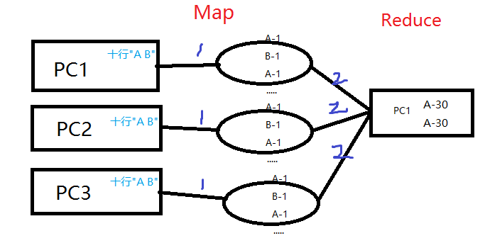
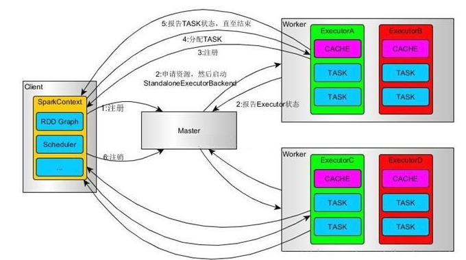

# Spark计算为什么比Hadoop快
大家都说Spark要快，可是究竟怎么个快法。他们的计算模型具体是什么样子的呢？你可能从网上搜到了较为笼统的答案，Hadoop是基于磁盘的，Spark是基于内存的。所以后者要快，但是究竟是什么地方放到了内存里呢？是整个操作的数据吗？显然不太可能。让我们从`WordCount`的例子看下，Hadoop的MR计算模型和Spark的DAG计算模型。<br><br>
我们设定这样一个场景，有一个文件被分成三份存到三台机器上了，刚好这个文件有30行每一行都是"A B"这个字符串，三台机子干好是平均分得十行字符串。都来运行WC程序，我们知道最后的结果肯定是A-30 B-30。来看下Hadoop和Spark执行过程吧。
# WordCount in MapReduce
从[网上](http://blog.csdn.net/a60782885/article/details/71308256)拷贝了一份代码
```java
public static class WordCountMap extends  
        Mapper<LongWritable, Text, Text, IntWritable> {  
    private final IntWritable one = new IntWritable(1);  
    private Text word = new Text();  
  
    public void map(LongWritable key, Text value, Context context)  
            throws IOException, InterruptedException {  
        String line = value.toString();  
        StringTokenizer token = new StringTokenizer(line);  
        while (token.hasMoreTokens()) {  
            word.set(token.nextToken());  
            context.write(word, one);  
        }  
    }  
}  
```
```java
public static class WordCountReduce extends  
        Reducer<Text, IntWritable, Text, IntWritable> {  
    public void reduce(Text key, Iterable<IntWritable> values,  
                       Context context) throws IOException, InterruptedException {  
        int sum = 0;  
        for (IntWritable val : values) {  
            sum += val.get();  
        }  
        context.write(key, new IntWritable(sum));  
    }  
}  
```
上面是map和reduce部分，我们来分析下具体的执行过程,Map过程是三台机器同时执行的每台机器最后得到A-1 B-1 A-1 B-1...（一共十个）这样的结果，因为大家统计并行计算，所以这里提高了速度，而这个中间结果在MR中是存储到磁盘上的。之后在Reduce中收集这些中间结果则需要将这些磁盘文件读出来进行网络传输，传到Reduce的机器上（下图2这一步），reduce的机器可能是任意一台PC也可指定，例如就是PC1,然后在PC1上将收集到的三份子结果进行reduce操作获得最后的结果。

注意这里有两个重点，第一**中间结果是存到硬盘**的，这样在存储和后面读取的时候速度较慢；第二Reduce操作必须等三台机器的Map操作全部执行完成才能开始，如果PC3性能极差则要一直等他Map完，才能开始后续操作。  <br>

这个WC方法其实还可以稍作改进在Map后添加一个combiner过程每台机子先统计下自己的WC。即每台机器获得A-1 B-1 ...这个中间结果后，再对其处理获得A-10 B-10这个结果，这样又将部分计算压力分散到了Mapper，最后交给reduce计算的压力就少一些。这里就又多了一组中间结果，同样也是存到硬盘文件。
# WordCount in Spark
Spark采用的算法叫做`DAGScheduler`，有向无环图的操作流程。这里要注意MapReduce其实广义上是指，将任务分给Mapper执行，最后交给少数Reducer汇总的思想，Hadoop的MapReduce是一种实现方法。Spark的DAG其实也是一种MapReduce，只不过Hadoop比较不要脸的直接把自己的计算方法起名MapReduce了，后面都不好起名字了。其实所有的计算框架都是在实践广义的MR，只不过细节上出现了分歧。<br><br>
```java
sc.textFile("hdfs://192.168.4.106:9000/README.md")
        
    //一行一个元素--->一个单词一个元素
    .flatMap(new FlatMapFunction<String,String>() {
        @Override
        public Iterator<String> call(String o) throws Exception {
            return Arrays.asList(o.split(" ")).iterator();
        }
    })
        
    //一个单词一个元素--->[单词,1]为元素
    .mapToPair(new PairFunction<String, Text, IntWritable>() {
        @Override
        public Tuple2<Text, IntWritable> call(String s) throwsException {
            return new Tuple2<>(new Text(s),new IntWritable(1));
        }
    })

	//对相同的单词 的个数进行聚合(相加)
    .reduceByKey(new Function2<IntWritable, IntWritable, IntWritable>() {
        @Override
        public IntWritable call(IntWritable i, IntWritable i2)throws Exception {
            return new IntWritable(i.get()+i2.get());
        }
    }) 
       
   //结果保存到HDFS另一个文件下，以便日后使用   
   .saveAsHadoopFile("hdfs://192.168.4.106:9000/res2",Text.class,
         IntWritable.class,SequenceFileOutputFormat.class);
```
上述程序其实是画了一个流程图（有向无环图）就是对数据集进行第一步flatmap操作，然后mapToPair操作，最后是reduceByKey操作就可以获得W-C了。而这个程序的作用是启动SparkContext然后向Master节点提交这个流程图。<br>
Master节点拿到流程图之后向Worker节点下发这个流程图，意思就是这个是家庭作业大家都按照这个作业要求在自己的家里去做吧。<br>
Worker节点收到流程图后开始做作业，如果是yarn模式，对在自己能访问到的文件块进行着相关操作，如果不是yarn则需要master分配每个Work应该统计的文件块，然后再开始执行流程图。<br>
每个节点按照流程图执行完毕，如果有行动操作例如count函数，则需要每个节点都进行数个数最后加一个总和交给驱动程序。<br>
这是从[网上](https://www.cnblogs.com/tgzhu/p/5818374.html)盗的一张图
  
这里我们可以看出虽然也是每个节点并行执行一些操作最后做汇总的思路，但是细节上和Hadoop有很大的不同，每个节点都拿到了整个程序的流程图。都按照流程图去执行，在理解和编程模型上要比MR简单很多。而且重点是RDD的连续操作的中间结果是存到内存里的，例如上面的flatMap操作之后得到的结果是[A,B,A,B...]，每个Worker有10个AB，这个中间结果就是存到每台机器的内存中的，在下一步mapToPair的时候就是直接操作这个内存变量。而且这种计算模型另一个优点是每台机器是独立展开的，例如worker1完成了flatMap操作直接就进行mapToPair操作，不需要等待其他worker，不过在混洗数据(shuffle)的时候还是要等待上一个阶段(stage)。所以spark最大的改进在于中间结果放到了内存。<br>
# 小结
Hadoop的MR其实并非完败于Spark，比如在机器性能较差内存较低的情况或者中间结果占用内存不能承受的情况，将中间结果存放到硬盘中是不得已的选择，这时候Hadoop是适用的，不过Spark也可以选择将中间结果固化到硬盘[囧]。<br>
从这里简单的执行过程介绍，我们大体上了解了两者的执行流程，也明白了Spark在内存中计算的说法来源。
