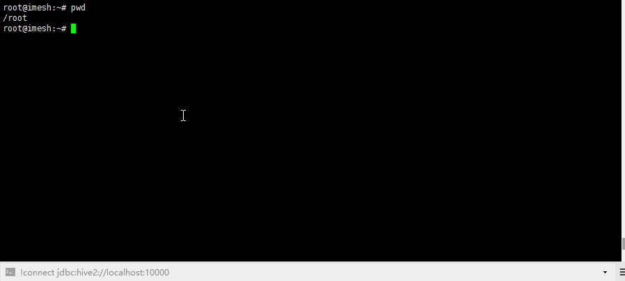

# Hive
# 1 简介
Hive是Hadoop家族的一员，它能在HDFS存储的结构化或者半结构化的文件上运行类似sql的查询。通俗讲就是能将普通文件抽象成表，例如有个1.txt文件内容如下。三列分别是id name和age。
```
1	张三	22
2	李四	33
3	王五	12
```
通过Hive就可以将这个文件看成一张表，只要设置列之间是'\t'隔开。就可以运行sql查询，如
```
select count(*) from tablename where age>20;
```
反过来想，我们将这些数据直接存到`MySQL`不是更好吗，为什么要存到Hadoop然后用Hive查询呢？
原因主要有：
- 1 海量数据MySQL无法应对，而HDFS可以
- 2 MySQL只能存储结构化数据，Hive可以将半结构化的文件约束成表
- 3 MySQL在大量数据的查询的时候是一台机子孤军奋战，Hive是将sql转化为MapReduce程序运行
当然Hive也有很多缺点：
- 1 将sql转化为MapReduce程序，MapReduce前面提到过逐渐被Spark等代替，以任务的形式提交程序不是实时返回结果的查询。
- 2 写的sql其实是Hivesql，只能实现一部分sql，很多功能不支持，例如表关联，事务等等
- 3 完全的关系型、结构化存储有更好的方案`GreenPlum`(后续文章会介绍)
# 2 搭建[2.3.0]
Hive依赖于HDFS，请先完成[HDFS搭建](Hadoop.md)  
1 下载安装包并解压，配置环境变量`HIVE_HOME`为解压后的目录，并添加bin目录到PATH中  
2 安装mysql用于存储hive的元数据，同时需要将mysql的jdbc的jar放入hive的lib目录下。  
3 修改$HIVE_HOME/conf/[hive-site.xml](conf/hive-site.xml)  
在$HIVE_HOME/conf/hive-env.sh中也添加一行
```
export HADOOP_HOME=xxxxxxxxx
```
4 初始化元数据
```shell
nohup hive --service metastore &

schematool -dbType mysql -initSchema
```
5 启动hiveserver2
```shell
nohup hive --service hiveserver2 &
```
6 客户端查询工具
```
beeline
```
1.x版本的hive指令在2.x中也进行了保留，但已经不推荐使用：
```
hive
```
# 3 使用hive查询
查询方式同样有自己提供的CLI和JavaAPI的方式，这里我们同样只讲前者。
使用create table指令可以创建表row format可以界定列之间的隔开。
```
CREATE TABLE test(id int,name string,age int)ROW FORMAT DELIMITED FIELDS TERMINATED BY '|';
```
利用load指令可以将本地或者hdfs中的文件转化成hive中的表。
```
load data local inpath '/root/2.txt' into table test;
```
不加local参数则是hdfs文件导入表中，如果文件中某一行和表格不一致，则尽量匹配，实在匹配不到的字段就是NULL


Hive运行order by或group by的时候会转化成MapReduce程序去执行，这里会有警告Hive-On-MR将会被弃用，请选择Spark等执行器。

