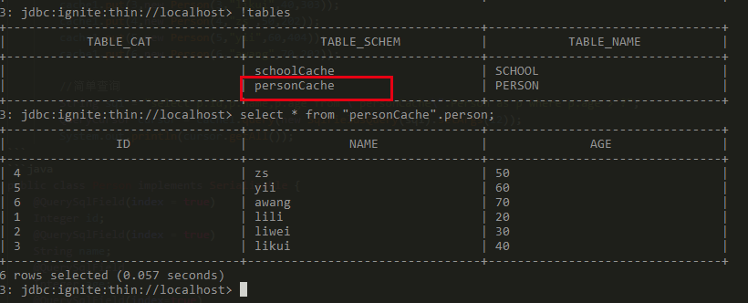
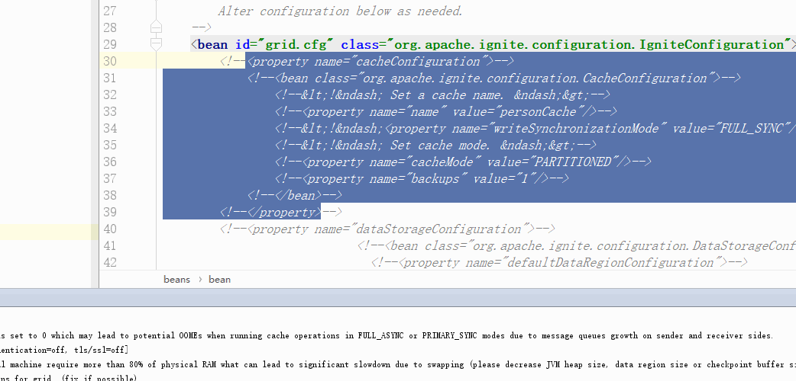
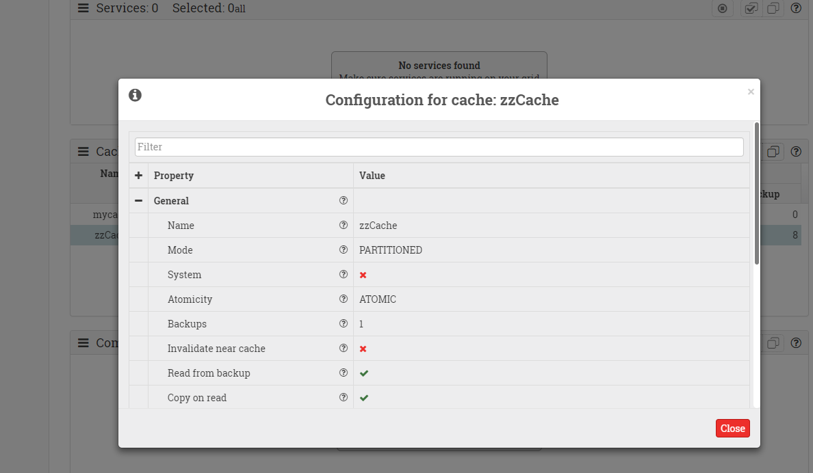
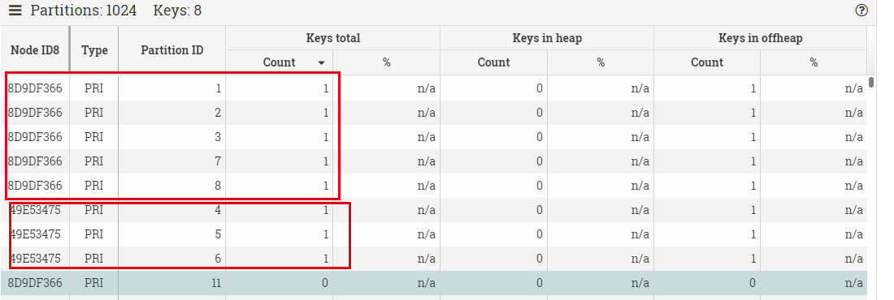
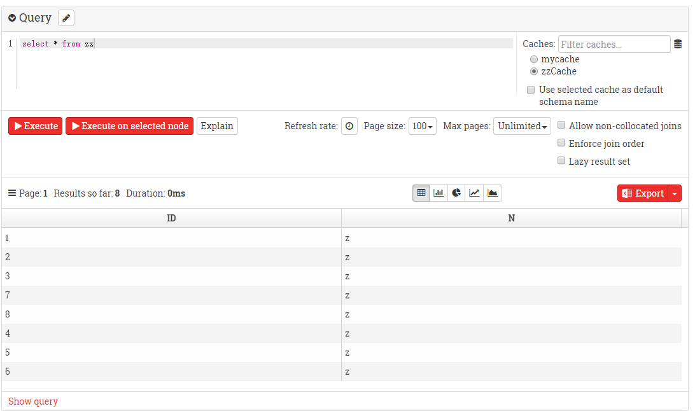

# 6 键值对存储
Ignite实现了Jcache标准，可以对序列化的对象进行存储。通俗讲就是可以直接存储对象了，比如我们在java中有个user集合，就可以将他存到Ignite中。你只需要引入依赖，然后就可以写程序了。
```xml
<dependency>
        <groupId>org.apache.ignite</groupId>
        <artifactId>ignite-core</artifactId>
        <version>${ignite.version}</version>
</dependency>
<dependency>
    <groupId>org.apache.ignite</groupId>
    <artifactId>ignite-spring</artifactId>
    <version>${ignite.version}</version>
</dependency>
<dependency>
    <groupId>org.apache.ignite</groupId>
    <artifactId>ignite-indexing</artifactId>
    <version>${ignite.version}</version>
</dependency>
```
```java
        Ignite ignite= Ignition.start("config/default-config.xml");
        Ignition.setClientMode(true);

        CacheConfiguration<Integer,Person> cfg1 = new CacheConfiguration();
        cfg1.setName("personCache");
        //cfg1.setBackups(1);

        //这里约定是IndexedType接成对的参数，每对参数为K.class,V.class
        cfg1.setIndexedTypes(Integer.class, Person.class);

        IgniteCache<Integer,Person> cache1 = ignite.getOrCreateCache(cfg1);

        cache1.put(1,new Person(1,"lili",20,202));
        cache1.put(2,new Person(2,"liwei",30,101));
        cache1.put(3,new Person(3,"likui",40,303));
        cache1.put(4,new Person(4,"zs",50,202));
        cache1.put(5,new Person(5,"yii",60,404));
        cache1.put(6,new Person(6,"awang",70,202));

        //简单查询
        String sql = "select p.id,p.name,p.age from \"personCache\".Person as p where p.age > ?";
        QueryCursor cursor = cache1.query(new SqlFieldsQuery(sql).setArgs(12));
        System.out.println(cursor.getAll());
```
```java
public class Person implements Serializable {
    @QuerySqlField(index = true)
    Integer id;
    @QuerySqlField(index = true)
    String name;
    @QuerySqlField
    Integer age;
    @QuerySqlField(index=true)
    Integer schoolId;
}
```
从这个例子中我们发现了可以将java的类进行cache存储，通过简单的put get就可以存和查，我们发现这和HashMap的用法类似，只是需要对类实现序列化接口，并对字段添加查询的注解，不同于HashMap这些数据是存到Ignite中了。

## backup
我们可以在java代码中设置（提倡这种方式，比较灵活，可以无侵入接入已有集群）
```java
cfg1.setBackups(1);
```
或者修改配置文件（注意修改cacheName，配置文件启动后如果没有这个cacheName则会创建，有的话则会修改属性）
```xml
<bean class="org.apache.ignite.configuration.IgniteConfiguration">
    ...
    <property name="cacheConfiguration">
        <bean class="org.apache.ignite.configuration.CacheConfiguration">
            <!-- Set a cache name. -->
            <property name="name" value="cacheName"/>
            <!-- Set cache mode. -->
            <property name="cacheMode" value="PARTITIONED"/>
            <!-- Number of backup nodes. -->
            <property name="backups" value="1"/>
        </bean>
    </property>
</bean>
```
    
设置backup=1，也就意味着，任意一个节点宕机后，一定有个备份节点可以顶替上来。于是我们看到上图中宕机一个节点后，再次查询仍然能够查到数据。（注意：这次查询的时候出现了几秒钟的阻塞）
# 7 WebConsole
[web监视器教程](https://youtu.be/V-o3IFVnk5k)，有了他你可以监控集群各个节点的健康状态，查看各个cache的配置信息，查看cache中数据分别在哪些机子上存储了，强制GC，还可以在web界面下进行sql查询。  
你要做的只是登录[https://console.gridgain.com](https://console.gridgain.com)页面，然后按照提示下载web-agent。

然后到集群中找任意一个节点将`libs\optional\ignite-rest-http`文件夹放到`libs`即向上移动了一层，然后重启这一个节点。

最后启动下载的agent下的{sh/bat}文件就可以。

下面是一些界面功能的展示：  
  
  
  
该网页的工作原理是和本地的rest服务做实时交互并图形化显示，本地rest服务则是在上述文件拷贝重启后就在8080端口启动了，ignite有着丰富的rest接口，可以参考这个[文档](https://www.zybuluo.com/liyuj/note/977079#122rest-api)
# 8 小结
我们看到了Ignite的sql存储本质是一种键值对的存储，并且我们知道了最原始的键值对操作的方法，他遵循Jcache规范，我们可以用java进行一些列的查询。甚至我们了解到有些方便的监控状态的rest接口和图形化界面。  

Ignite给我们带来了很多惊喜，但是他却不止这些功能。他还可以作为分布式内存文件系统IGFS来加速HDFS，共享内存加速Spark；他还提供了分布式数据结构Queue和Set可以存到集群的内存中；他还有将web session放到集群共享的功能；他甚至不只是个存储构架，还有计算构架和机器学习功能。这里我们不再分别介绍，感兴趣可以自己去了解。
