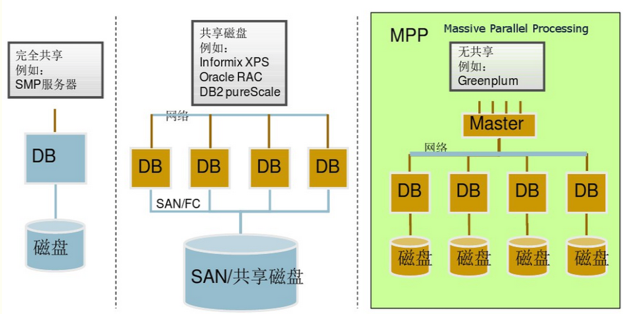
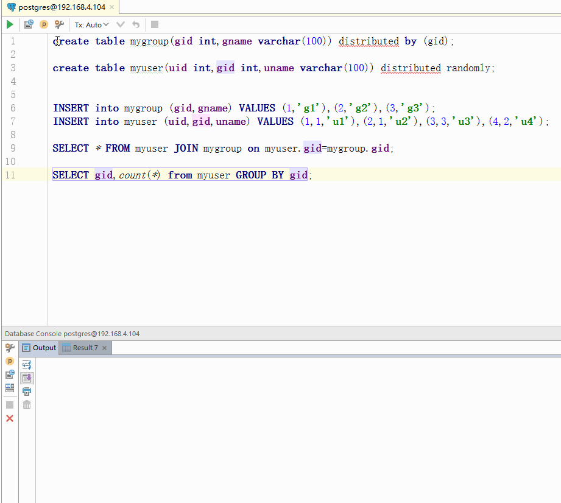

# GreenPlum(GPDB)
# 简介
`GPDB`是一种分布式的关系型数据库，它基于`PostgreSQL`改装而成，可以形象的将其理解为分布式的PostgreSQL。和传统分布的数据库不一样，GPDB采用了ShareNothing的模式，在存储数据(Insert)的时候是按照一定规则存到不同的Segement节点上面的。例如第一条insert可能存到了PC1上，第二条可能就是PC2，按照一定的规则使数据可以均匀的分布到各个节点上面。<br>
    
图片来自互联网。  
在而在查询数据的时候例如`SELECT * FROM tbname WHERE age = 20`则是master节点将sql语句下发到每个数据节点，分别运行该查询，最后将结果汇总返回给用户。SQL本身就是查询是一种计算，这样将计算分到了每个节点上，本质上也是一种MapReduce的思想。  
GPDB用法非常简单，他和pipelinedb一样是基于postgresql的数据库，所以只需要通过sql就可以操作。
# 搭建
搭建过程可以参考[网上的教程](https://www.cnblogs.com/liuyungao/p/5689588.html)，这里因为设备问题我就没有搭建集群的GPDB。而是用docker的形式启动了一个单机版的GPDB
```
docker run -i -p 5432:5432 -t kevinmtrowbridge/greenplumdb_singlenode
```
# 读写
GPDB在进行写操作的时候，对用户是透明的，都是通过一条Insert语句即可完成写入，其实底层是在多台机器上存储的。这取决于在创建数据库的时候使用的分布策略。例如
```
create table mytb(id int,name varchar(100)) distributed by (id);
```
就是按照id的hash值进行分布式存储的，即将id做hash运算后获得一个整数除以总的集群机器的余数就是他要存到的机器的编号。常用的分布策略还有随机分布`distributed randomly;`更多的分布策略可以看这篇[博客](http://blog.chinaunix.net/uid-23284114-id-5601403.html)。<br>
对于读操作则是将sql语句下发到每台机器上面单独去执行。这也是很好理解的。我们像平时操作Postgresql一样的操作GPDB
```sql
create table mygroup(gid int,gname varchar(100)) distributed by (gid);

create table myuser(uid int,gid int,uname varchar(100)) distributed randomly;


INSERT into mygroup (gid,gname) VALUES (1,'g1'),(2,'g2'),(3,'g3');
INSERT into myuser (uid,gid,uname) VALUES (1,1,'u1'),(2,1,'u2'),(3,3,'u3'),(4,2,'u4');

SELECT * FROM myuser JOIN mygroup on myuser.gid=mygroup.gid;

SELECT gid,count(*) from myuser GROUP BY gid;
```

# 备份
前面的讲述中，我们会发现没有备份的策略，如果有一台存储的机器坏掉了，则会造成这些数据的永久丢失。还好有mirror设置，对于每个存储数据的segment，都可以设置mirror，当segment宕机后mirror就可以顶替上来。