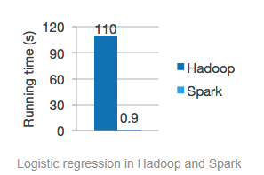
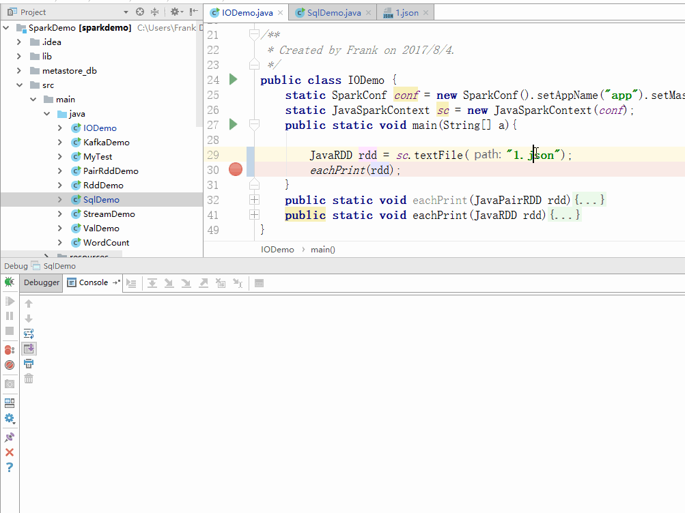

# Spark
# 1 简介
`Spark`的出生就是为了针对`Hadoop`的`MapReduce`计算思想，我们现在仍然能从Spark的官网首页看到一个`Spark vs Hadoop(MapRed)`的速度比较。<br>
  
Spark除了速度上体现出巨大的优势，在使用上也比MapReduce更加容易，对所有的数据流程抽象除了RDD的概念。学习者只要掌握RDD的通用API就可以轻松编程。<br>
Spark还封装了`SparkSQL`来顶替Hive中的MapReduce运算，`SparkStream`来进行流式计算，还有针对机器学习的`SparkMLib`。

正因为使用简单、性能强大、涉足领域广这些特点，Spark已经是大数据分析最受欢迎的框架之一了。<br><br>
不过我们始终要明白一点，Hadoop没有被代替，尤其是HDFS。即使Spark有这么多优点，他也只是个计算框架，而非存储框架。仍要依赖于HDFS的分布式存储或其他存储。<br>
之前的HDFS是部署为主，学会操作文件就够了。而Spark则需要学习使用语言进行编程。可选的语言有`Scala`,`Java`,`Python`。我以Java为主进行讲述<br>
# 2 RDD
RDD(Resilient Distributed Datasets)翻译过来是弹性分布式数据集，一听这个名字似乎是非常复杂的概念。单纯去理解这个概念是很难的，我们可以直接看RDD的使用，能更好的理解这个东西。<br>
## 2.1 JavaRDD
**知识点1**：RDD作为一种数据集他可以来自一个java的集合变量，也可以来自一个文本文件，可以把它看做一个List。
```java
//List可以转RDD
List<String> list= Arrays.asList("a","b","c","d");
JavaRDD<String> rdd = sc.parallelize(list);
//文件也可以转RDD(文本每行是一个元素)
JavaRDD<String> rdd2=sc.textFile("/root/1.txt");
```
**知识点2**：RDD是抽象的过程，即上述例子中RDD声明后，实际并不存储数据，而是代表一个过程，更像是有向无环图，封装了各种操作流程，但是实际上并没有执行操作，所以虽然在编程中可以先按照list理解但是实际上却是一片虚无，更准确的讲应该是产生我们想象的List的蓝图。<br><br>
下图展示RDD的惰性：
 
**知识点3**：我们发现了，只要返回值还是RDD的操作（转化操作），其实都没有实际执行操作，只有返回值为实际类型的时候（行动操作）才会触发这个结果所需要的所有操作。这一点一定要理解。
```java
List<Integer> list= new ArrayList<Integer>(Arrays.asList(0,1,2,3));

JavaRDD<Integer> rdd = sc.parallelize(list).filter(new Function<Integer, Boolean>(){
    @Override
    public Boolean call(Integer integer) throws Exception {
        return integer<3;
    }
});

list.remove(1);

System.out.println(rdd.collect());//打印[0,2]而非[0,1,2]
```
**知识点4**：JavaRDD都有哪些可选操作？<br>  
**常见RDD->RDD转化操作：**<br>  

| 函数名 | 效果 |  
| -------- | ---- |  
| filter     | 去掉不想要的         |  
| map        | 对每个元素执行指定转化 |  
| flatmap    | 每个元素可以转化为多个 |   

**常见[RDD1+RDD2]->RDD转化操作：**<br>  

| 函数名       | 效果               |  
| -------- | ---- |  
| union      | 操作俩RDD返回并集(不去重)|  
| intersection| 操作俩RDD返回交集|  

**常见行动操作**<br>  

| 函数名       | 返回类型               |  
| --------   | ----               | 
| collect  | List|  
| top | List|  
| take | List|  
| count | Long |  
| countByValue | Map |  
| reduce | 元素类型 | 
| aggregate| 任意类型 | 

我们可以看出RDD有着很多集合的操作，在大数据处理中过滤操作，映射操作以及聚合操作都是经常用到的。例如统计一篇英文文章中每个单词出现的次数，并且不要统计全是大写的单次。就可以用：
```
rdd.filter(new Function<String,Boolean>{
	public Boolean call(String s) throws Exception {
                return !s.matches("^[A-Z]*$");
         }
    })
    .countByValue()
    ;
```

## 2.2 JavaPairRDD
**知识点1**：如果说JavaRDD是List抽象，那么JavaPairRDD就是Map抽象。<br>
**知识点2**：JavaPairRDD是一种特殊的JavaRDD，所以JavaRDD的函数他都有，即将每个`Tuple<_1,_2>`看做一个元素。<br>
**知识点3**：JavaPairRDD特有的操作（其实可以通过基本的操作实现）简单列举。<br>  

| 函数名       | 效果               |  
| --------   | ----               |  
| keys| key组成的RDD|  
| values| value组成的RDD|  
| groupByKey| key分组|  
| reduceByKey| 在分组基础上对每组value进行聚合|  
| combineByKey| 也是聚合但是更复杂|  
| mapValues| 只对value进行map运算key保持返回等大的pairRdd |  
| flatMapValues| 只对value进行的flatmap运算返回扩大版pairRdd |  
| lookUp| 取出某一个特定key的value集返回一个list| 
## 3 实战
环境要求：java+maven<br>
学习Spark并不需要下载Spark，只有需要Spark任务运行在独立集群或者Yarn上的时候才需要搭建Spark服务。<br>
maven依赖
```
<dependency>
	<groupId>org.apache.spark</groupId>
	<artifactId>spark-core_2.10</artifactId>
	<version>2.2.0</version>
</dependency>
```
在开始之前，需要自己练习上述函数的使用，了解他们的效果，这里提供了[Demo项目](https://github.com/sunwu51/SparkDemo)可以参考里面[RDD](https://github.com/sunwu51/SparkDemo/blob/master/src/main/java/RddDemo.java)和[PairRDD](https://github.com/sunwu51/SparkDemo/blob/master/src/main/java/PairRddDemo.java)的示例代码。
### 3.1 从均值的例子切入
给定一个含有好多整数的rdd，求这些数的均值？<br>
**错误思路1**<br>
```java
Integer sum = rdd.reduce(new Function2<Integer,Integer,Integer>() {
    public Integer call(Integer o, Integer o2) throws Exception {
        return o+o2;
    }
});

Integer count = rdd.count();

Double avg = (sum*1.0)/count;
```
最简单的思路，求和再求个数，最后除下就是均值。结果是没有问题，但是这个思路确实有问题，问题就在于用了两个行动操作，分别求了sum和count，遍历了两遍集合，不可取。<br>
从这个思路中，我们得到的启发是可以在一次循环的过程中同时完成求和和计数的运算是最好的方案。<br>

**错误思路2**<br>
```java
final  int[] sum = {0};
rdd.foreach(new VoidFunction<Integer>() {
    public void call(Integer i) throws Exception {
        sum[0]+=i;
    }
});

Integer count = rdd.count();

Double avg = (sum[0]*1.0)/count;
```
这种思路和思路1 是一样的，不过不同的是这种方法是错误的，最后结果是0。原因在于`foreach`函数对每个元素执行操作是在这个元素所在的节点上面执行的。而sum数组是一个全局数据，驱动程序将全局数组和RDD操作下发给每个节点，每个节点都拿到一个sum数组的初值即{0}，节点间的变量不能共享，操作结束后也不能将变量回传，所以sum在驱动程序中的值始终为{0}。<br><br>
从这个思路中，我们得到的启发是变量在节点间是不能共享的，RDD的函数看似是一个整体，但是RDD集合是零散的分布在多台机子上面的数据，每台机子操作自己含有的部分元素。如果是行为操作例如count函数则会每台机子对自己上面的元素求个数，最后汇总给驱动程序，驱动程序将这些值加起来作为返回值。<br><br>
【名词解释：驱动程序，就是我们的java代码。驱动程序将序列化的RDD有向无环执行图提交给master。master从中创建任务，并将其提交给worker执行。master协调不同的工作阶段。】

**正确思路**<br>
```java
JavaPairRDD<Integer,Integer> pairRDD = rdd2.mapToPair(
	new PairFunction<Integer, Integer, Integer>() {
        @Override
        public Tuple2<Integer, Integer> call(Integer i) throws Exception {
            return new Tuple2<Integer, Integer>(i,1);
        }
    }
);

Tuple2<Integer,Integer> tuple2 = pairRDD.reduce(
    new Function2<Tuple2<Integer, Integer>,
    Tuple2<Integer, Integer>, Tuple2<Integer, Integer>>() {
        @Override
        public Tuple2<Integer, Integer> call(Tuple2<Integer, Integer> t1, Tuple2<Integer, Integer> t2) throws Exception {
            return new Tuple2<Integer, Integer>(t1._1()+t2._1(),t1._2()+t2._2());
        }
);
    
Double avg =(tuple2._1()*1.0)/tuple2._2();
```
将整数RDD转化为【整数，1】的PairRDD，然后对PairRDD运行一次聚合，分别对两个元素求和，前者得到的就是整数和，后者就是个数。最后一除。搞定，一次行动操作完成了求均值。<br><br>
从这种思想中我们发现，对于RDD的一些扩展操作我们就可以将其扩展为PariRDD，因为转化操作在真正执行的时候是每个节点并行转化存在自己那里的元素的，所以效率很高。<br><br>
也不应该拘泥于上述实现方式，只要是通过一次执行操作能获得正确的结果的都是好的。比如不用PairRDD而是借助Spark提供的累加器和RDD的foreach方法也可以实现这个一次循环求出均值的效果。读者可以自己探索下，这里不再赘述。

### 3.2 WordCount的例子
数每个单词出现的个数，是大数据分析的Hello World。通过前面的方法介绍，我们明显可以看出最简单的数单词就是直接调用`countByValue`方法。但是我们需要注意的是该方法是个行动操作，会将最后的结果直接返回给驱动程序，有时候我们想要的可能是将结果存储到HDFS中。<br><br>
下面给出能实现WordCount的程序（函数式）
```java
//!!!!!!一定注意在聚合操作之前要将聚合的KV类型提前注册如下
static SparkConf conf = new SparkConf().setAppName("app")
.registerKryoClasses(new Class<?>[]{
            org.apache.hadoop.io.IntWritable.class,
            org.apache.hadoop.io.Text.class
});
static JavaSparkContext sc = new JavaSparkContext(conf);

public static void main(String[] a){

    sc.textFile("hdfs://192.168.4.106:9000/README.md")
        
        //一行一个元素--->一个单词一个元素
		.flatMap(new FlatMapFunction<String,String>() {
            @Override
            public Iterator<String> call(String o) throws Exception {
                return Arrays.asList(o.split(" ")).iterator();
            }
        })
        
        //一个单词一个元素--->[单词,1]为元素
        .mapToPair(new PairFunction<String, Text, IntWritable>() {
            @Override
            public Tuple2<Text, IntWritable> call(String s) throws Exception {
                return new Tuple2<>(new Text(s),new IntWritable(1));
            }
        })

		//对相同的单词 的个数进行聚合(相加)
        .reduceByKey(new Function2<IntWritable, IntWritable, IntWritable>() {
            @Override
            public IntWritable call(IntWritable i, IntWritable i2) throws Exception {
                return new IntWritable(i.get()+i2.get());
            }
        }) 
       
       //结果保存到HDFS另一个文件下，以便日后使用   
       .saveAsHadoopFile("hdfs://192.168.4.106:9000/res2",Text.class,
          IntWritable.class,SequenceFileOutputFormat.class);
}          
```
# 4 小结
最初版本就有的`RDD`是经常使用的编程模型封装了很多基本的操作，在后面会提到另外两个模型`DataFrames`和`DataSet`，也有着相似的API。


