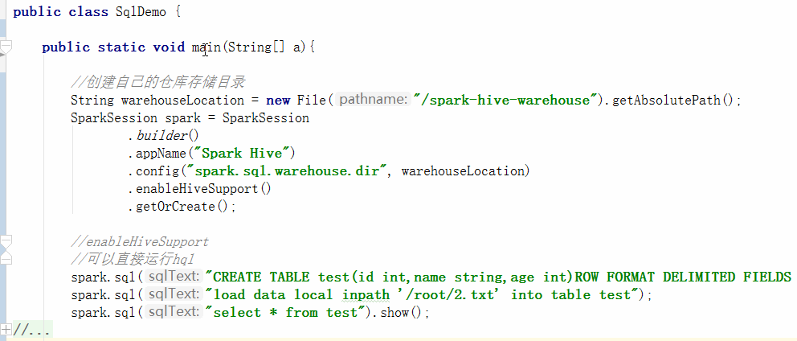

# SparkSQL
# 1 简介
SparkSQL的功能和Hive很像，可以对结构或半结构化的文件，以表的形式进行查询。SparkSQL效率要更高一些，在Hive那一节中我们也可以看到在执行MR操作的时候，提示`Hive-On-MR`已经不被赞成使用了。<br>

SparkSQL用法上也更为简单：<br>
可以选择直接执行sql语句，也可以通过封装好的方法来执行操作。<br>
可以在本机查询本地的文件，也可以放到集群上查询。<br>
可以借助Hive，也可以独立运行。<br><br>

灵活性太大，有时候使得学习起来变得复杂。本节我们先以本地模式运行`SparkSQL`，且不借助`Hive`，来快速了解基本的操作方法，之后再结合Hive和集群介绍生产环境下的使用方式。

# 2 快速开始
其实Spark的[官方文档](http://spark.apache.org/docs/latest/sql-programming-guide.html)写的非常详细，建议去读一下。
加入依赖
```
<dependency>
    <groupId>org.apache.spark</groupId>
    <artifactId>spark-core_2.10</artifactId>
    <version>2.2.0</version>
</dependency>
<dependency>
	<groupId>org.apache.spark</groupId>
	<artifactId>spark-hive_2.10</artifactId>
	<version>2.2.0</version>
</dependency>
```
切入点是`SparkSession`而不是之前的`SparkContext`
```
SparkSession spark = SparkSession
            .builder()
            .appName("Spark SQL")
            .master("local")
            .getOrCreate();
```
这部分的示例代码可以参考[SparkDemo仓库](https://github.com/sunwu51/SparkDemo)的[SqlDemo.java](https://github.com/sunwu51/SparkDemo/blob/master/src/main/java/SqlDemo.java)
## 2.1 查询JSON文件
注意在大数据里，JSON文件一般是一行是一个JSON对象的文件。<br><br>
读取并展示JSON内容：
```java
Dataset<Row> df = spark.read().json("1.json");
df.show();
//+---+-----+-------+
//|age|group|   name|
//+---+-----+-------+
//| 23|    1|  Frank|
//| 32|    2|  David|
//| 34|    1|   Lily|
//| 27|    1|Johnson|
//+---+-----+-------+
```
df写入json文件：  
（明明是DataSet为什么叫df呢？因为早期版本read返回的是DataFrame，2.0后具有更好特性的DataSet<Row>替换掉了DataFrame）
```
df.write().json("2.json")
```
运行复杂的SQL查询语句：
```java
Dataset<Row> df = spark.read().json("1.json");

//建立视图--相当于起个表名方便之后sql查询
df.createOrReplaceTempView("people");

//并没有告诉age字段是整形，即使json中是字符串"23"也能自动转整数
Dataset<Row> sqlDF = spark.sql("select name,age from people where age>14 and name like '%Frank%'");

sqlDF.show();
//+--------+---+
//|    name|age|
//+--------+---+
//|   Frank| 23|
//|Franklin| 42|
//+--------+---+
```
使用函数封装运行查询（等价于SQL查询）：
```java
Dataset<Row> df = spark.read().json("1.json");

Dataset<Row> sqlDF = df.where(col("age").between("22","36")).where(col("name").like("%John%")).select(col("*"));

sqlDF.show();
//+---+-----+-------+
//|age|group|   name|
//+---+-----+-------+
//| 27|    1|Johnson|
//+---+-----+-------+

sqlDF = df.groupBy("group").agg(col("group"), max("age"),sum("age"));

sqlDF.show();
//+-----+-----+--------+--------+
//|group|group|max(age)|sum(age)|
//+-----+-----+--------+--------+
//|    1|    1|      34|    84.0|
//|    3|    3|      42|    42.0|
//|    2|    2|      32|    53.0|
//+-----+-----+--------+--------+
```
不想存json，Spark默认支持6种文件格式的读写`'sequencefile', 'rcfile', 'orc', 'parquet', 'textfile' and 'avro'.`。默认的save和load方法是`parquet`格式。
```
df.write().save("file");
Dataset<Row> newdf = spark.read().load("file");
```
## 2.2 spark on hive
需要将hadoop的配置文件`hdfs-site.xml` `core-site.xml`以及`hive的hive-site.xml`放到`$SPARK_HOME/conf`里
```java
//创建自己的仓库存储目录(hive的在/user/hive/warehouse如果想使用hive已有的表则配置这个路径)
String warehouseLocation = new File("/spark-hive-warehouse").getAbsolutePath();
SparkSession spark = SparkSession
   .builder()
   .appName("Spark Hive")
   .config("spark.sql.warehouse.dir", warehouseLocation)
   .enableHiveSupport()
   .getOrCreate();

//enableHiveSupport
//可以直接运行hql
spark.sql("CREATE TABLE test(id int,name string,age int)ROW FORMAT DELIMITED FIELDS TERMINATED BY '|'");

spark.sql("load data local inpath '/root/2.txt' into table test");
spark.sql("select * from test").show();
```

# 3 小结
SparkSQL可以对结构化/半结构化文件，如json进行快速查询。通过`SparkOnHive`我们可以像使用hive客户端工具一样的使用SparkSQL，有着比Hive更高的效率，Spark将细节屏蔽，因而用起来非常方便。<br><br>
对于sql不能应付的灵活数据分析处理，Spark允许我们将`DataSet`转化为`JavaRDD<Row>`类型，使用RDD的API进行分析和操作。【这里还有个DataFrames的概念因为新的API中都开始用DataSet所以就不讲了】<br><br>
需要注意如果运行SparkOnHive的程序，必须先安装Hive并且将配置文件hive-site.xml拷贝到spark的conf目录。Spark只是将底层计算框架进行了替换，而上层的查询语句（HiveSql）以及表的结构化方式仍然需要Hive。<br><br>
另外提一句，DF也是惰性的，在调用行动方法之前，他也是只代表我们产生想要结果需要对数据执行的步骤，而通常我们都理解成了这些步骤的结果。<br>
*Datasets are "lazy", i.e. computations are only triggered when an action is invoked. Internally, a Dataset represents a logical plan that describes the computation required to produce the data.*
<br>


